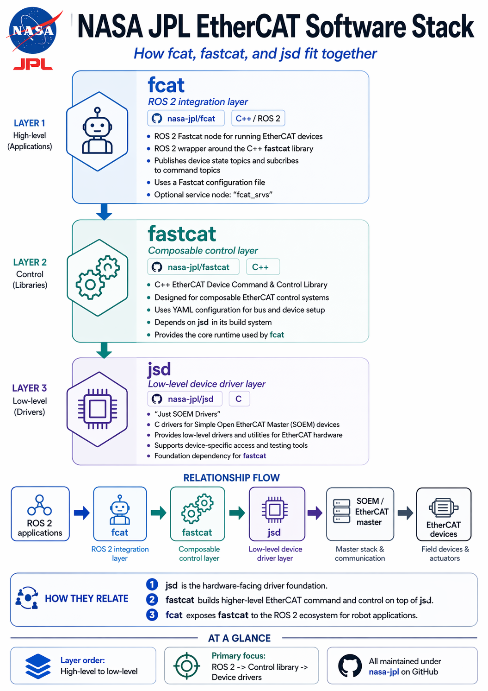

This repository contains `fcat` and `fcat_msgs`, the ROS 2 integration layer for the FCAT EtherCAT stack.

At a high level:

- [SOEM](https://github.com/OpenEtherCATsociety/SOEM) provides the EtherCAT master library.
- [jsd](https://github.com/nasa-jpl/jsd) provides low-level device drivers on top of SOEM.
- [fastcat](https://github.com/nasa-jpl/fastcat) provides composable EtherCAT command and control.
- [fcat](https://github.com/nasa-jpl/fcat) exposes that stack to ROS 2 through topics and services.
- `fcat_msgs`: provides the ROS 2 message definitions for `fcat`.

See *README* in each of those repositories for more details on their functionality and usage.

See this infographic for a visual representation of the software stack:
  
